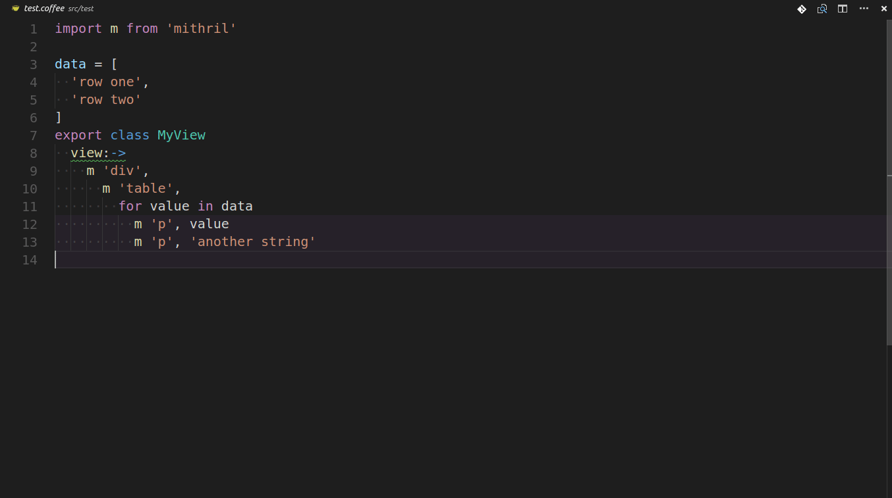

# coffee2preview

## An extension for Visual Studio Code™️

This is an extension for developing coffeescript allowing you to preview the compiled javascript in a syntax highlighted side panel.

It relies heavily on the microsoft example code [here](https://github.com/Microsoft/vscode-extension-samples/tree/master/contentprovider-sample) and the atom package found [here](https://github.com/leny/atom-coffeescript-check).

## Features

This addon allows you to check your code when it may be ambiguous using the latest coffescript.

You can also convert only selections (and multiple ones at that!)

You can add a keybinding in your settings by searching for 'coffee2preview.check'.

## Extension Settings

Include if your extension adds any VS Code settings through the `contributes.configuration` extension point.

For example:

This extension contributes the following settings:

* `myExtension.enable`: enable/disable this extension
* `myExtension.thing`: set to `blah` to do something

## Known Issues

* No live updating. I'm working on it.
* When compiling multiple selections it will list them in the order you selected them in instead of the order they are in the file.

## Release Notes

### 1.0.0

Initial release.
