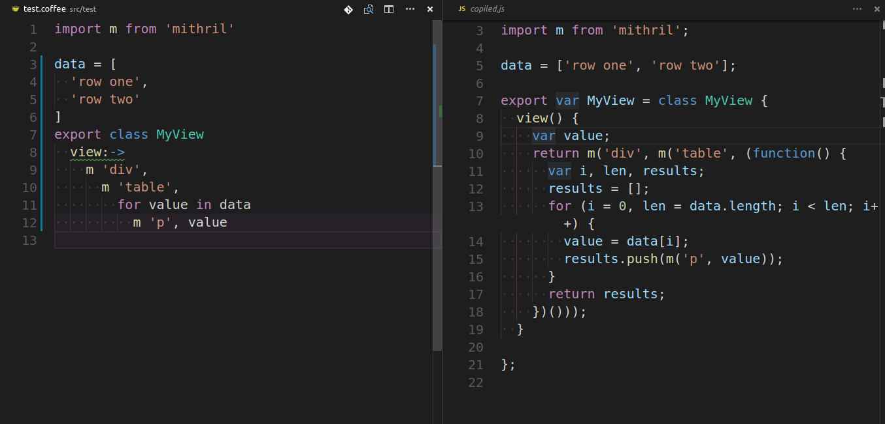

# coffee2preview

## An extension for Visual Studio Code™️

This is an extension for developing coffeescript allowing you to preview the compiled javascript in a syntax highlighted side panel.

## Features

This addon allows you to check your code when it may be ambiguous using the latest coffescript.

You can add a keybinding in your settings by searching for 'coffee2preview.check'.

## Extension Settings

Include if your extension adds any VS Code settings through the `contributes.configuration` extension point.

For example:

This extension contributes the following settings:

* `myExtension.enable`: enable/disable this extension
* `myExtension.thing`: set to `blah` to do something

## Known Issues

* no live updating. I'm working on it.

## Release Notes

### 1.0.0

Initial release.
